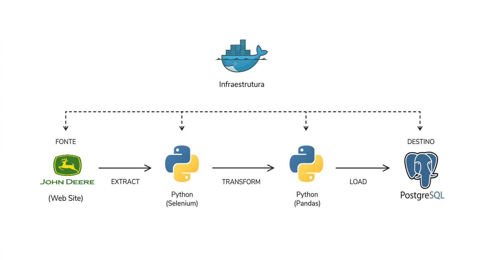

<h1 align="center">ETL: Extração e catalogação de peças para carga ERP</h1>

<div align="center">
  
[](https://python.org)
[](https://www.docker.com/)
[](https://www.postgresql.org/)

</div>

Este projeto consiste em um pipeline de dados (ETL) automatizado, desenhado para realizar Web Scraping de catálogo de peças navegando entre sistemas e subsistemas, utilizando como exemplo o catalogo da colhedora CH570 - John Deere disponivel em repositório online.

O pipeline extrai todos registros de peças dentro do catalogo:

* Valida se há referencias duplicadas.
* Padroniza nomenclaturas com descrição curta e longa.
* Classifica por sistema e subsistema.

## Arquitetura e Fluxo de Dados


* `Extract:` Um script em Python realiza o web scraping na fonte de dados: (https://partscatalog.deere.com/jdrc/navigation/equipment/14012), navegando pelas categorias e coletando registros de peças.
* `Transform:` Os dados brutos são tratados validando referencias e duplicidades, saneados e padronizados, sendo classificados por referência, descrição curta, descrição longa, sistema e subsistema.
* `Load:` Referências válidas e padronizadas inseridas na base de dados.

## Tecnologias Utilizadas
* `Linguagem:` Python 3.14 (Pandas, Selinum)
* `Banco de Dados / Data Warehouse:` PostgreSQL 16
* `Infraestrutura:` Docker & Docker Compose

Estrutura do Repositório
* `APP/` - Contém a interface visual do painel (`dashboard.py`).
* `Docker/` - Infraestrutura do banco de dados (`docker-compose.yml`).
* `ETL/` - Scripts modulares contendo a lógica de Extração, Transformação e Carga.
* `SQL/` - Scripts e consultas auxiliares do banco de dados.
* `main.py` - Arquivo orquestrador principal na raiz do projeto.
  
## Detalhes da Infraestrutura (Docker)
O projeto foi empacotado utilizando docker-compose, rodando múltiplos serviços interconectados para simular um ambiente de produção real. A infraestrutura conta com:
* **PostgreSQL (16)**: Atua com dupla responsabilidade neste projeto. Ele serve como o banco de metadados padrão do Airflow e também hospeda o banco de dados analítico (combustiveis) onde os dados finais são carregados.

## Como Executar o Projeto Localmente

### Pré-requisitos.
Certifique-se de ter instalado em sua máquina:
* [Docker](https://docs.docker.com/get-docker/)
* [Docker Compose](https://docs.docker.com/compose/install/)

## Passo a Passo
### 1. Clone o repositório

```bash
git clone https://github.com/amorimq/ETL-Catalogador
cd ETL-Catalogador
```
### 2. Configure as variáveis de Ambiente: 
O projeto utiliza um arquivo .env para gerenciar as credenciais locais do banco de dados e do orquestrador. Para rodar o projeto, crie uma cópia do arquivo de exemplo:
```bash
cp .env.example .env
```
### 3. Inicie PostgreSQL:
```bash
docker-compose up -d
```
### 5. Acesse as Interfaces:
* Banco de Dados (PostgreSQL): O banco de dados para consulta dos dados ingeridos está exposto na porta 5433 da sua máquina host.
  * Host: localhost
  * Porta: 5433
  * Database: catalogo_jd
  * User: usuario_catalogo
  * Password: pecas
### 6. Inicie a aplicação.
#### SQL:
```sql
CREATE TABLE dim_maquina (
    id_maquina SERIAL PRIMARY KEY,
    modelo VARCHAR(50) UNIQUE NOT NULL,
    tipo VARCHAR(50)
);

CREATE TABLE fato_pecas_colhedora (
    codigo_peca VARCHAR(50) PRIMARY KEY,
    descricao_curta VARCHAR(150),
    descricao TEXT,
    sistema VARCHAR(255),
    subsistema TEXT,
);
```

#### Inicie a aplicação via terminal:

```bash
python main.py
```
### 7. Encerrando a Aplicação
Para parar os containers e limpar a rede criada pelo Docker, execute:
```bash
docker-compose down
```

